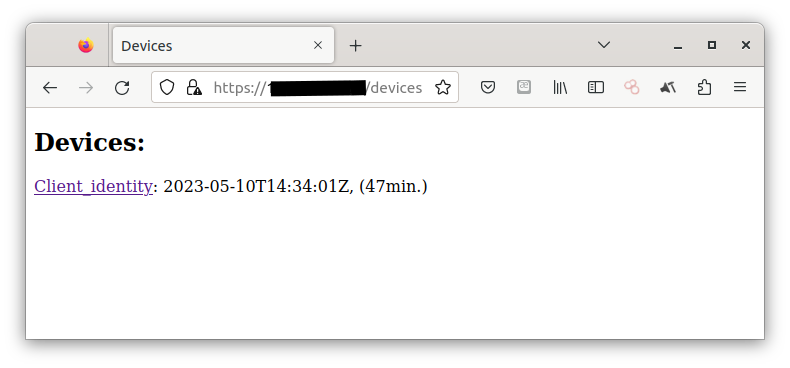
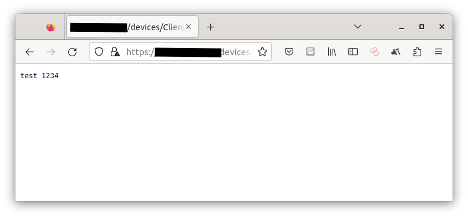
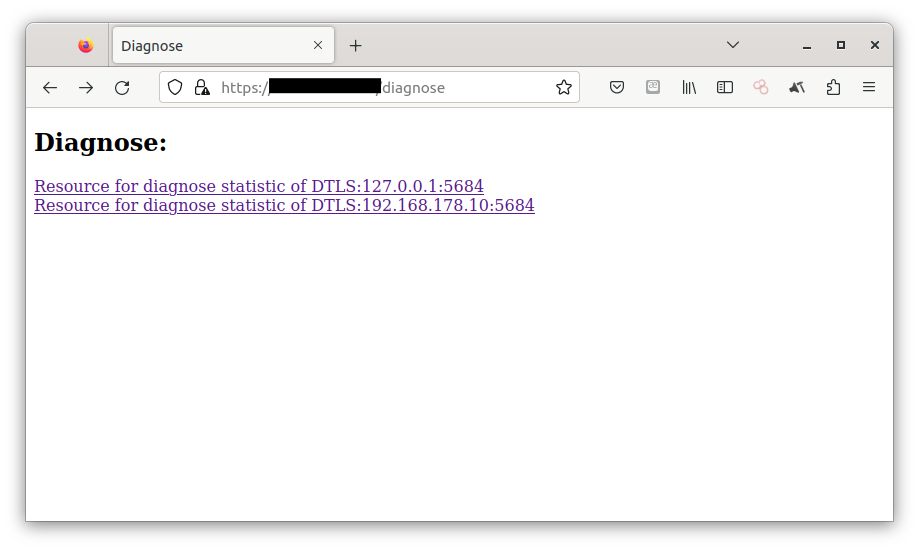
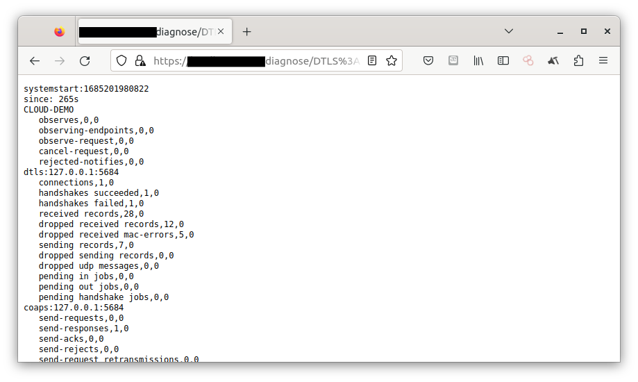

# Californium (Cf) - Cloud Demo Server

Simple cloud demo server.

The server uses coap endpoints over DTLS 1.2 CID. It supports PSK. For now no certificates based device authentication is supported.

Supports resource "devices":

```sh
coap-client -v 6 -m POST -e "test 1234" -u Client_identity -k secretPSK coaps://<destination>:5684/devices
v:1 t:CON c:POST i:307a {01} [ Uri-Path:devices ] :: 'test 1234'
INFO Identity Hint '' provided
v:1 t:ACK c:2.04 i:307a {01} [ ]
INFO *  <source>:33681 <-> <destination>:5684 DTLS: SSL3 alert write:warning:close notify
```

```sh
coap-client -v 6 -m GET -u Client_identity -k secretPSK coaps://<destination>:5684/devices/Client_identity
v:1 t:CON c:GET i:7fcf {01} [ Uri-Path:devices, Uri-Path:Client_identity ]
INFO Identity Hint '' provided
v:1 t:ACK c:2.05 i:7fcf {01} [ Content-Format:application/octet-stream ] :: binary data length 9
<<746573742031323334>>
<<t e s t   1 2 3 4 >>
INFO *  <source>:60667 <-> <destination>:5684 DTLS: SSL3 alert write:warning:close notify
```

A device may also read the data of other devices.

The server comes with an optional very simple HTTPS server to GET the last CoAP POSTs to resource "devices".





The server comes also with an optional `diagnose` resource. That records the number of messages and failures.






## General Usage

**Note:** the Cloud Demo Server is not released! It requires a [Build using Maven](../../README.md#build-using-maven) before usage.

Start the cf-cloud-demo-server-3.10.0.jar with:

```sh

Usage: CloudDemoServer [-h] [--diagnose]
                       [--https-credentials=<httpsCredentials>]
                       [--https-port=<httpsPort>] [--wildcard-interface | [[--
                       [no-]loopback] [--[no-]external] [--[no-]ipv4] [--[no-]
                       ipv6] [--interfaces-pattern=<interfacePatterns>[,
                       <interfacePatterns>...]]...]] [--psk-file=<file>
                       [--psk-file-password64=<password64>]]
                       [--store-file=<file> --store-max-age=<maxAge>
                       [--store-password64=<password64>]]
      --diagnose             enable 'diagnose'-resource.
  -h, --help                 display a help message
      --https-credentials=<httpsCredentials>
                             Folder containing https credentials in 'privkey.
                               pem' and 'fullchain.pem'. Defaults to
                               Californium's demo credentials.
      --https-port=<httpsPort>
                             Port of https service. If not provided or 0, https
                               service is not started.
      --interfaces-pattern=<interfacePatterns>[,<interfacePatterns>...]
                             interface regex patterns for coap endpoints.
      --[no-]external        enable coap endpoints on external network.
      --[no-]ipv4            enable coap endpoints for ipv4.
      --[no-]ipv6            enable coap endpoints for ipv6.
      --[no-]loopback        enable coap endpoints on loopback network.
      --psk-file=<file>      Filename of PSK store for coap.
      --psk-file-password64=<password64>
                             Password for PSK store. Base 64 encoded.
      --store-file=<file>    file-store for dtls state.
      --store-max-age=<maxAge>
                             maximum age of connections in hours to store dtls
                               state.
      --store-password64=<password64>
                             password to store dtls state. Base 64 encoded.
      --wildcard-interface   Use local wildcard-address for coap endpoints.

Examples:
  DemoServer --no-loopback
    (DemoServer listening only on external network interfaces.)

  DemoServer --psk-file device.psk --store-file dtls.bin --store-max-age 168 \
             --store-password64 ZVhiRW5pdkx1RUs2dmVoZg==
    (DemoServer with PSK credentials from file and dtls-graceful restart.
     Devices/sessions with no exchange for more then a week (168 hours)
     are skipped when saving.)
```

to see the set of options and arguments.

When the server is started the first time, it creates the "CaliforniumCloudDemo3.properties" file. this contains the settings, which may be adjusted by editing this file.

```
# Californium CoAP Properties file for Cloud-Demo Server
# Wed May 10 21:42:21 CEST 2023
#
# Cache maximum devices.
# Default: 5000
CACHE_MAX_DEVICES=5000
# Threshold for stale devices. Devices will only get removed for new
# ones, if at least for that threshold no messages are exchanged using
# that device.
# Default: 1[d]
CACHE_STALE_DEVICE_THRESHOLD=1[d]
# Reload device credentials interval. 0 to load credentials only on
# startup.
# Default: 30[s]
DEVICE_CREDENTIALS_RELOAD_INTERVAL=30[s]
# Reload https credentials interval. 0 to load credentials only on startup.
# Default: 30[min]
HTTPS_CREDENTIALS_RELOAD_INTERVAL=30[min]
...
```

**Note:** to use encrypted PSK files, please use the [cf-encrypt](../../cf-utils/cf-encrypt/README.md) utility.

## PSK Device Credentials

In order to authenticate the devices, PSK (Pre-Shared-Key) is used ([RFC4279](https://www.rfc-editor.org/rfc/rfc4279)). The credentials are stored in a [text-file, e.g. demo.psk](./service/demo.psk) in the local file system of the cloud VM. RPK (Raw-Public-Key) ([RFC7250](https://www.rfc-editor.org/rfc/rfc7250)) will follow. 

```
# PSK store for Cloud Demo
# default openssl PSK credentials
Client_identity=c2VjcmV0UFNL
```

The format use the device name, followed by a '=' and the secret key in base 64 encoding. If the secret key is hexadecimal encoded, provide it with ":0x", e.g.

```
# PSK store for Cloud Demo
# default openssl PSK credentials
Client_identity=:0x73656372657450534B
```

**Note:** the file is read using UTF-8 encoding, '=' are not supported for device names. Lines starting with '#' are skipped as comment, therefore a device name must not start with a '#'. Empty lines are also skipped. 

The cloud demo server checks frequently, if the file has changed and automatically reloads the credentials.

Devices already connected with removed credentials are kept connected but on the next handshake these device will fail to communicate with the cloud demo server.

## DTLS Graceful Restart

The cloud demo server supports to save the DTLS connection state and load it again. With this feature, it's possible to restart the server without losing the DTLS connection state. Provide the arguments `--store-file` (filename to save and load the DTLS connection state), `--store-password64` (base64 encoded password to save and load the DTLS connection state), and `--store-max-age` (maximum age of connections to be stored. Value in hours) are provided.

Stop the server and start it again using the same `--store-file` and `--store-password64` as before and also provide the `--store-max-age`.

**Note:** if it takes too long between stopping and restart, the clients will detect a timeout and trigger new handshakes. So just pause a small couple of seconds!

**Note:** only the DTLS state is persisted. To use this feature, the client is intended to use mainly CON request and the server the use piggybacked responses. Neither DTLS handshakes, separate responses, observe/notifies, nor blockwise transfers are supported during a restart.

## HTTPS forwarding

The server runs as user "cali" and therefore requires to forward TCP:443 to a user service port (8080). Copy [iptables service](./service/iptables.service) into `/etc/systemd/system` and [iptables-firewall.sh](./service/iptables-firewall.sh) into `sbin` and make that file executable.

## HTTPS x509 certificate

The https server requires x509 certificate credentials. You may setup a own CA, use a public one, or the CA provided by your cloud-provider. For a very first test you may also use the Californium's demo certificates, but that comes with security flaws so replace that in time. If the Californium's demo certificates are used, the web-browser will warn you about the certificate and you need to accept it explicitly.

Regardless of a private, public or cloud provider's CA, the result should be a private key and a related and signed x509 certificate chain. Save both in a directory using the names "privkey.pem" and "fullchain.pem". That directory must be passed in using `--https-credentials`. Ensure, the user "cali" or group "cali" has read access to it.

Please consult the CA's documentation how to create these credentials.

### HTTPS x509 certificate - Let's encrypt

One public CA is [Let's Encrypt](https://letsencrypt.org/). 

If you want to use it, install [certbot](https://certbot.eff.org/instructions?ws=other&os=ubuntufocal) or a similar tool and request a x509 http server certificate for your domain. Raw ip-addresses are not supported by let's encrypt. Prior to requesting a certificate, you need to ensure, that you possess the domain and that domain points to the right ip-address of the cloud-vm. Consult the documentation of your domain provider how to achieve that.

```sh
certbot certonly --standalone --key-type ecdsa --elliptic-curve secp256r1 -d <domain>
```

You will be asked about an e-mail address and to accept the [Let's Encrypt Service Agreement](https://letsencrypt.org/documents/LE-SA-v1.3-September-21-2022.pdf).

The received credentials are stored in `/etc/letsencrypt/archive/<domain>/` and read links are available in `/etc/letsencrypt/live/<domain>`. Pass that `--https-credentials=/etc/letsencrypt/live/<domain>` to the cloud demo server.

Let's encrypt assumes by default the root user reads the credentials. The cloud demo server uses the limited user "cali". In order to read the credentials by that limited user "cali", the access rights on the file-system must be adjusted.

Adjust permission to grant others read-access to the directories "live" and "archive":

```sh
chmod go+rx /etc/letsencrypt/live
chmod go+rx /etc/letsencrypt/archive
```

And in order to read the private key, you need to add adjust the permission of the file as well.

Set group to "cali":

```sh
chown root:cali /etc/letsencrypt/archive/<domain>/privkey1.pem
```

(**Note:** in "archive" the files are numbered, in "live" are links to the most recent file are without numbers.)

and adjust permission to grant the group read-access:

```sh
chmod g+r /etc/letsencrypt/archive/<domain>/privkey1.pem
```

(See [letsencrypt.sh](./service/letsencrypt.sh).)

These permissions are also granted, if the credentials are renewed. `Certbot` does this renewal automatically. The https server also checks for new certificates and restarts automatically, when new certificates are detected.

For more details about `certbot, see instructions at [certbot](https://eff-certbot.readthedocs.io/en/stable/using.html#where-are-my-certificates).

## fail2ban

To ban some host from continue sending malicious messages, Californium support to write the source ip-addresses of malicious messages into a special log file.
The cloud demo server uses logback for logging, and configures therefore a file-appender and configures the logger "org.eclipse.californium.ban" to use that.

```
	<appender name="BAN_FILE" class="ch.qos.logback.core.rolling.RollingFileAppender">
		<file>logs/ban.log</file>
		<rollingPolicy class="ch.qos.logback.core.rolling.SizeAndTimeBasedRollingPolicy">
			<!-- roll-over monthly, or if filesize exceeds -->
			<fileNamePattern>logs/ban-%d{yyyy-MM}.%i.log</fileNamePattern>
			<!-- each file should be at most 1MB, keep 10 files worth of history, but at most 10MB -->
			<maxFileSize>1MB</maxFileSize>
			<maxHistory>10</maxHistory>
			<totalSizeCap>10MB</totalSizeCap>
		</rollingPolicy>

		<encoder>
			<!-- use tab to separate timestamp from message -->
			<pattern>[%date{yyyy-MM-dd HH:mm:ss}]\t%msg%n</pattern>
		</encoder>
	</appender>

	<logger name="org.eclipse.californium.ban" level="INFO" additivity="false">
		<appender-ref ref="BAN_FILE" />
	</logger>

```

The content of that file is:

```
[2023-05-12 07:10:11]	coaps Option Content-Format value of 3 bytes must be in range of [0-2] bytes. 5203ABDA15E9B763 DTLS Ban:??.??.??.??
[2023-05-12 07:57:50]	https: GET /actuator/gateway/routes HTTP/1.1 HTTPS Ban: ??.??.??.??
[2023-05-12 08:26:38]	https: GET /robots.txt HTTP/1.1 HTTPS Ban: ??.??.??.??
```

### fail2ban - installation

```
sudo apt install fail2ban
```

To configure fail2ban, define filters, e.g.:

```
[INCLUDES]

before = common.conf

[Definition]

failregex = DTLS\s+Ban:\s+<HOST>$
```

and copy [calidtls.conf](./service/fail2ban/calidtls.conf) into folder "/etc/fail2ban/filter.d". That selects the `<HOST>` after the tags "DTLS" and "Ban:".

Additional [calihttps.conf](./service/fail2ban/calihttps.conf) filters for "HTTPS" and "Ban:", and [calilogin.conf](./service/fail2ban/calilogin.conf) filters for "LOGIN" and "Ban:". These filter must additionally be copied into folder "/etc/fail2ban/filter.d".

The different filters enables to define different jail rules for violations, e.g.:

```
[DEFAULT]
bantime  = 1800
findtime = 300

[cali-dtls]
enabled  = true
port     = 5684
protocol = udp
filter = calidtls
logpath  = /home/cali/logs/ban.log

# https: use nat destination port 8080!

[cali-https]
enabled  = true
port     = 8080
protocol = tcp
filter = calihttps
logpath  = /home/cali/logs/ban.log

[cali-login]
enabled  = true
port     = 8080
protocol = tcp
filter = calilogin
logpath  = /home/cali/logs/ban.log
bantime  = 300
findtime = 150
```

and copy [cali2fail.conf](./service/fail2ban/cali2fail.conf) into folder "/etc/fail2ban/jail.d". That applies the before defined filter to the "ban.log" and "jails" `<HOST>`. DTLS and HTTPS violations will be banned for 30 minutes, if 3 violations are detected within 5 minutes. LOGIN violations will be banned for 5 minutes, if 3 violations are detected within 2 minutes and 30 seconds.

To check the jail, use

```
fail2ban-client status cali-https
Status for the jail: cali-https
|- Filter
|  |- Currently failed:	2
|  |- Total failed:	1000
|  `- File list:	/home/cali/logs/ban.log
`- Actions
   |- Currently banned:	0
   |- Total banned:	23
   `- Banned IP list:	
```

## Systemd service

**Note:** the Cloud Demo Server is not released! It requires a [Build using Maven](../../README.md#build-using-maven) before usage.

The server runs as [systemd service](./service/cali.service). It may be installed either manually or using the [installation script](./service/cloud-installs/deploy-dev.sh). 

Manual installation follows the [cf-unix-setup](../cf-unix-setup). It requires also to add the [HTTPS forwarding](#https-forwarding) and to create the https x509 credentials as [described above](#https-x509-certificate).

The [installation script](./service/cloud-installs/deploy-dev.sh) supports the [ExoScale](https://www.exoscale.com/), [DigitalOcean](https://cloud.digitalocean.com), and [AWS](https://aws.amazon.com). It requires an account at that provider, download and install the provider's CLI tools and comes with costs! See [ExoScale Script](./service/cloud-installs/provider-exo.sh), [DigitalOcean Script](./service/cloud-installs/provider-do.sh) and [AWS Script](./service/cloud-installs/provider-aws.sh) for more details and requirements.

The script provides jobs to "create" (create cloud VM/EC2 instance), "install" (install cloud demo server service from local sources and builds, along with fail2ban, https-forwarding and preparation for `certbot`), "update" (Update cloud demo server service from local sources and builds), "login" (ssh login into cloud-VM), and "delete" (delete cloud-VM).

Usage:

```sh
./deploy-dev.sh exo create install
```

Creates a ExoScale cloud-VM and install the cloud-demo-server. On finish, the installation is completed by a reboot. Initially Californium's Demo Certificates are used and the default openssl PSK device credentials are provided (identity: Client_identity, shared key: secretPSK). Both is intended to be replace soon.

To replace the Demo Certificates, redirect the intended domain to the ip-address of the create cloud VM. This ip-address is shown at the end of the installation:


```sh
...
Reboot cloud VM.
use: ssh root@?1.?2.??7.8? to login!
```

(Please consult your DNS provider how to redirect your domain to that ip-address.)

After redirecting the domain, login to the cloud VM.

```sh
ssh root@?1.?2.??7.8?
```

Request a certificate in that remote shell.

```sh
certbot certonly --standalone --key-type ecdsa --elliptic-curve secp256r1 -d <domain>
```

(For details see [instructions](#https-x509-certificate---lets-encrypt) above.)

To grant the permission for the file-system, execute

```sh
./letsencrypt.sh <domain>
```

also in that remote shell. This script also adapts the [/etc/systemd/system/cali.service](./service/cali.service) file on the cloud-VM and adding `--https-credentials` 

```
Environment="HTTPS_CERT_ARGS=--https-credentials=/etc/letsencrypt/live/<domain>"
```

to load the let's encrypt credentials for https. 
Finally it restart the service

That's it. After a couple of seconds try to test the coaps-server using:

```sh
coap-client -v 6 -m POST -e "test 1234" -u Client_identity -k secretPSK coaps://<domain>:5684/devices
```

and the https-server using a web-browser and `https://<domain>`. If both test are succeed, then your cloud demo server is installed well.

**Note:** The installation contains "secrets", e.g. to store the DTLS state or to read the PSK device credentials. Therefore a dedicated cloud-VM must be used and the access to that cloud-VM must be protected!
This basic/simple setup also uses the "root" user. Please replace/add a different user according your security policy.
