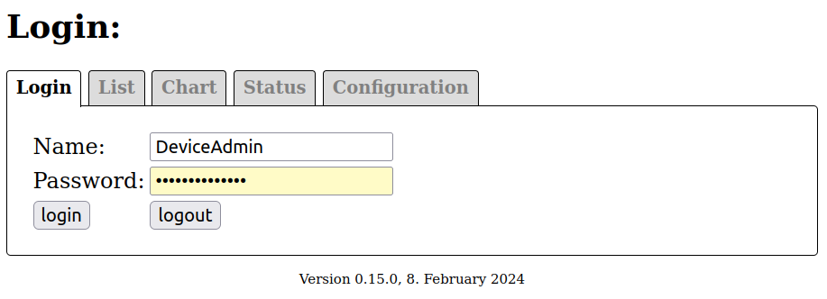
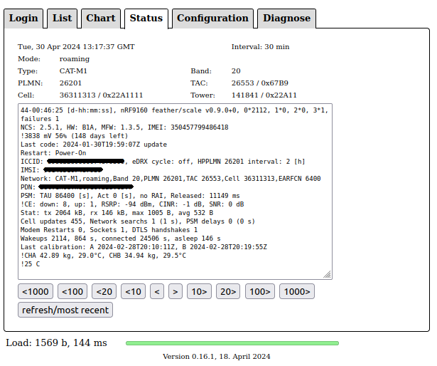
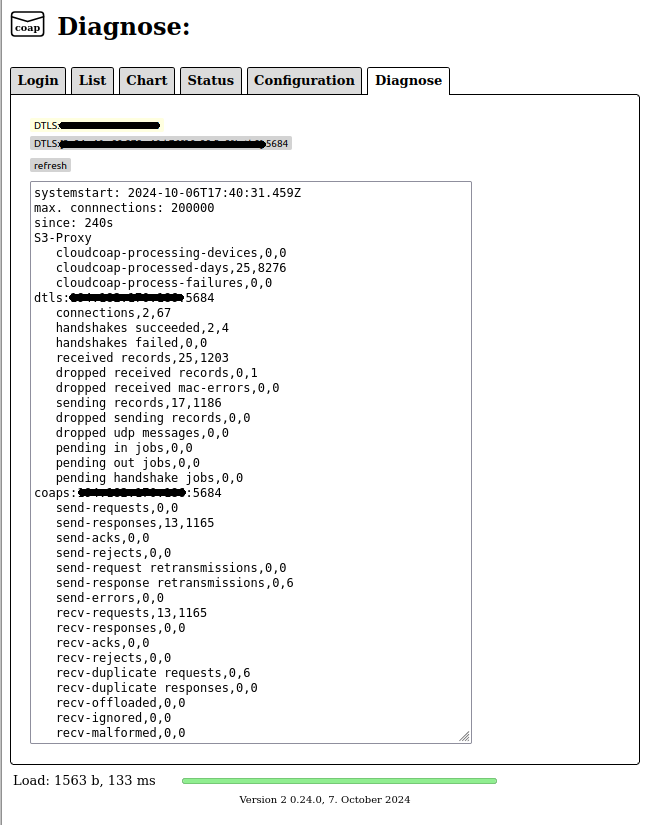

# Californium (Cf) - Cloud CoAP-S3-Proxy Server

## SCADA (supervisory control and data acquisition)

## - Reliable - Efficient - Encrypted -


Cloud CoAP-S3-Proxy Server for device communication with CoAP/DTLS 1.2 CID. Based on the [Eclipse/Californium CoAP/DTLS 1.2 CID java library](https://github.com/eclipse-californium/californium).

    Fill the missing link between the device and cloud.

The server supports DTLS 1.2 CID with **P**re**S**hared**K**ey (similar to username/password) and **R**aw**P**ublic**Key** (a public key without additional information like subject or validity as certificate) authentication for device communication. X509 certificate based device authentication may be added to the cloud deom server in the future. Californium (Cf) itself does already support it.

The sent data is forwarded with the proxy function to a **S**imple**S**torage**S**ervice (**S3**) to persist it. Your backend may either fetch the data from that S3 or you may use a included simple Web-Browser javascript **S**ingle**P**age**A**pplication to display the data and to visualize that in simple charts.

Example message sent by device:

```
22-03:02:30 [d-hh:mm:ss], nRF9160 feather/scale v0.9.0+0, 0*1061, 1*0, 2*0, 3*1, failures 0
NCS: 2.5.1, HW: B1A, MFW: 1.3.5, IMEI: 350457799486418
!3836 mV 56% (104 days left)
Last code: 2024-01-30T19:59:07Z update
Restart: Power-On
ICCID: ?????280666074879390, eDRX cycle: off, HPPLMN 26201 interval: 2 [h]
IMSI: ?????5107487939
Network: CAT-M1,roaming,Band 20,PLMN 26201,TAC 26553,Cell 30157572,EARFCN 6400
PDN: ???.???,???.???.???.???
PSM: TAU 86400 [s], Act 0 [s], no RAI, Released: 10823 ms
!CE: down: 8, up: 1, RSRP: -93 dBm, CINR: 5 dB, SNR: 6 dB
Stat: tx 1032 kB, rx 72 kB, max 1003 B, avg 529 B
Cell updates 162, Network searchs 1 (1 s), PSM delays 0 (0 s)
Modem Restarts 0, Sockets 1, DTLS handshakes 1
Wakeups 1062, 428 s, connected 12371 s, asleep 72 s
Last calibration: A 2024-02-28T20:10:11Z, B 2024-02-28T20:19:55Z
!CHA 37.20 kg, 31.1°C, CHB 34.55 kg, 31.9°C
!26 C
```

**Note:** the previous implementation uses the lines starting with an `!` for a accumulated data file named "series-date-time". That has changed and the current version accumulates the complete data into a "arch-date" file obsoleting the leading `!`. Use "https://<hostname>/v2" to use the web UI with the archive files.

Web-Browser application login page:



Web-Browser application device list page:


Web-Browser application chart page:


Web-Browser application device status page (data from device):



Web-Browser application device configuration page (data to device):


Web-Browser application server diagnose page:



Some more details about the web-UI can be found in [web-UI documentation](./docs/web-ui.md).

## Performance and Resources

[](./docs/quadrant.svg)

- The footprint of the OS and Java VM, around 800 MB RAM, requires to use at least 2 GB RAM.
- The maximum number of devices depends mainly on the available RAM. Per PSK around 3K per device, for certificate based devices 5K per device.
- The maximum number of requests per second also depends on the available RAM and CPU for processing. Usually the backend slows down the processing a lot. Without backend, a 4x3GHz System with 16 GB RAM runs 50000 requests/s. With backends, that’s usually much less.
- If S3 is used as backend, usually the write preformance of S3 limits then the number of requests/s. 300 requests/s up to 3000 requests/s could be found.
- The Javascript Web App is considered only for first steps, Therefore it may handle 100-200 device, it’s not expected to be used with more.

## General Usage

Start the cf-s3-proxy-server-3.13.0.jar with:

```
Usage: S3ProxyServer [-h] [--diagnose] [--[no-]coap] [--wildcard-interface |
                     [[--[no-]loopback] [--[no-]external] [--[no-]ipv4] [--[no-]
                     ipv6] [--interfaces-pattern=<interfacePatterns>[,
                     <interfacePatterns>...]]...]] [--https-port=<port>
                     --https-credentials=<credentials>
                     [--https-password64=<password64>]]
                     [--coaps-credentials=<credentials>
                     [--coaps-password64=<password64>]] [--device-file=<file>
                     [--device-file-password64=<password64>]]
                     [--store-file=<file> --store-max-age=<maxAge>
                     [--store-password64=<password64>]] [--provisioning
                     [--replace]] ([--domain-file=<file>
                     [--domain-file-password64=<password64>]] |
                     [[[--s3-endpoint=<endpoint>] [--s3-region=<region>]
                     [--s3-bucket=<bucket>] [--s3-acl=<acl>]
                     [--s3-concurrency=<concurrency>]
                     [--s3-external-endpoint=<externalEndpoint>]
                     [--s3-redirect] (--s3-config=<s3ConfigFile> |
                     [--s3-access-key=<accessKey> --s3-secret=<secret>])]
                     [--user-file=<file> [--user-file-password64=<password64>]]
                     [--config-file=<file>
                     [--config-file-password64=<password64>]]
                     [--http-forward=<httpForward>
                     [--http-authentication=<httpAuthentication>]
                     [--http-device-identity-mode=<httpDeviceIdentityMode>]]])
                     [[--spa-script=<singlePageApplicationScript>]
                     [--spa-css=<singlePageApplicationCss>] [--spa-reload]
                     [--spa-s3]
                     [--spa-script-v2=<singlePageApplicationScriptV2>]]
      --coaps-credentials=<credentials>
                             Folder containing coaps credentials in 'privkey.
                               pem' and 'pubkey.pem'
      --coaps-password64=<password64>
                             Password for device store. Base 64 encoded.
      --config-file=<file>   Filename of configs-store.
      --config-file-password64=<password64>
                             Password for configs-store. Base 64 encoded.
      --device-file=<file>   Filename of device store for coap.
      --device-file-password64=<password64>
                             Password for device store. Base 64 encoded.
      --diagnose             enable 'diagnose'-resource.
      --domain-file=<file>   Filename of domain-store.
      --domain-file-password64=<password64>
                             Password for domain-store. Base 64 encoded.
  -h, --help                 display a help message
      --http-authentication=<httpAuthentication>
                             Http authentication for forward coap-requests.
      --http-device-identity-mode=<httpDeviceIdentityMode>
                             Http device identity mode. Supported values: NONE,
                               HEADLINE and QUERY_PARAMETER. Default: NONE
      --http-forward=<httpForward>
                             Http destination to forward coap-requests.
      --https-credentials=<credentials>
                             Folder containing https credentials in 'privkey.
                               pem' and 'fullchain.pem'.
      --https-password64=<password64>
                             Folder containing https credentials in 'privkey.
                               pem' and 'fullchain.pem'.
      --https-port=<port>    Port of https service.
      --interfaces-pattern=<interfacePatterns>[,<interfacePatterns>...]
                             interface regex patterns for coap endpoints.
      --[no-]coap            Disable coap endpoints.
      --[no-]external        enable coap endpoints on external network.
      --[no-]ipv4            enable coap endpoints for ipv4.
      --[no-]ipv6            enable coap endpoints for ipv6.
      --[no-]loopback        enable coap endpoints on loopback network.
      --provisioning         enable 'prov'-resource for auto-provisioning.
      --replace              replaces previous device credentials entries with
                               new entries. For use during development. Don't
                               use it for production!
      --s3-access-key=<accessKey>
                             s3 access key.
      --s3-acl=<acl>         s3 canned acl. e.g. public-read
      --s3-bucket=<bucket>   s3 bucket. Default: devices
      --s3-concurrency=<concurrency>
                             s3 concurrency. Default 200
      --s3-config=<s3ConfigFile>
                             s3 configuration file.
      --s3-endpoint=<endpoint>
                             s3 endoint URI. e.g.: https://sos-de-fra-1.exo.io
                               for ExoScale in DE-FRA1.
      --s3-external-endpoint=<externalEndpoint>
                             s3 external endoint URI. e.g.: https://devices.
                               sos-de-fra-1.exo.io for bucket "devices" on
                               ExoScale in DE-FRA1.
      --s3-redirect          s3 supports redirects for endpoint.
      --s3-region=<region>   s3 region. Only AWS regions are supported.
                               Default: 'us-east-1'. (For other providers, try,
                               if the default works).
      --s3-secret=<secret>   s3 secret access key.
      --spa-css=<singlePageApplicationCss>
                             Single-Page-Application Cascading Style Sheets.
                               Default stylesheet.css
      --spa-reload           Reload Single-Page-Application script.
      --spa-s3               Single-Page-Application in S3.
      --spa-script=<singlePageApplicationScript>
                             Single-Page-Application script. Default app.js
      --spa-script-v2=<singlePageApplicationScriptV2>
                             Single-Page-Application script v2.
      --store-file=<file>    file-store for dtls state.
      --store-max-age=<maxAge>
                             maximum age of connections in hours to store dtls
                               state.
      --store-password64=<password64>
                             password to store dtls state. Base 64 encoded.
      --user-file=<file>     Filename of user-store.
      --user-file-password64=<password64>
                             Password for user-store. Base 64 encoded.
      --wildcard-interface   Use local wildcard-address for coap endpoints.

Examples:
  S3ProxyServer --no-loopback
    (S3ProxyServer listening only on external network interfaces.)

  S3ProxyServer --store-file dtls.bin --store-max-age 168 \
                --store-password64 ZVhiRW5pdkx1RUs2dmVoZg== \
                --device-file devices.txt --user-file users.txt

    (S3ProxyServer with device credentials and web application user.
     from file and dtls-graceful restart. Devices/sessions with no
     exchange for more then a week (168 hours) are skipped when saving.)
```

To see the set of options and arguments.

When the server is started the first time, it creates the "CaliforniumS3Proxy.properties" file. this contains the settings, which may be adjusted by editing this file.

```
# Californium CoAP Properties file for S3 Proxy Server
# Mon Sep 30 17:45:25 CEST 2024
#
# Cache maximum devices.
# Default: 5000
CACHE_MAX_DEVICES=5000
# Threshold for stale devices. Devices will only get removed for new
# ones, if at least for that threshold no messages are exchanged with
# that device.
# Default: 1[d]
CACHE_STALE_DEVICE_THRESHOLD=1[d]
# Reload device credentials interval. 0 to load credentials only on
# startup.
# Default: 1[min]
DEVICE_CREDENTIALS_RELOAD_INTERVAL=30[s]
# Reload HTTPS credentials interval. 0 to load credentials only on startup.
# Default: 30[min]
HTTPS_CREDENTIALS_RELOAD_INTERVAL=30[min]
# Maximum size of device configuration.
# Default: 1024
MAX_DEVICE_CONFIG_SIZE=1024
# S3 processing daily time after UTC midnight. S3 processing combines
# the messages of the last day into a weeks archive file. Usually run
# once a day. 0 to disable S3 processing.
# Default: 5[min]
S3_PROCESSING_DAILY_TIME=0[min]
# S3 processing initial delay. S3 processing combines the messages of
# the last day into a weeks archive file.
# Default: 20[s]
S3_PROCESSING_INITIAL_DELAY=20[s]
# S3 processing interval. S3 processing combines the messages of the
# last day into a weeks archive file. Usually run once a day. 0 to disable
# S3 processing.
# Default: 1[d]
S3_PROCESSING_INTERVAL=0[ms]
# Interval to read UDP drops from OS (currently only Linux).
# Default: 2[s]
UDP_DROPS_READ_INTERVAL=2[s]
# Reload user credentials interval. 0 to load credentials only on startup.
# Default: 30[s]
USER_CREDENTIALS_RELOAD_INTERVAL=30[s]
...
```

**Note:** to use encrypted device, config, user, or domain files, please use the [cf-encrypt](../../cf-utils/cf-encrypt/README.md) utility. Same applies for the https and coaps credentials, encrypted PKCS #8 is not supported, you must use PKCS #8 without encryption and apply that `cf-encrypt` utility.

## Device Credentials

Please see [Californium (Cf) - Cloud Demo Server - Device Credentials](../cf-cloud-demo-server#device-credentials).

## Web Application User

The users of the web application are stored in a [text-file, e.g. users.txt](./service/users.txt) in the local file system of the cloud VM.

```
# Web Application Users

*.s3='<read-only-S3-access-key-id>','<read-only-S3-access-key-secret>'

Thingy:91='cloudcoap'
.groups=Thing
.config=User

ThingsAdmin='cloudcoap-secret'
.groups=Thing,Monitor
.config=Admin
*.s3='<personal-S3-access-key-id>','<personal-S3-access-key-secret>'
```

The format uses the user `name`, followed by a '=' and the `<password>`, either in plain-text enclosed in single- `'` or double-`"` quotes, or in base64 without quotes. The `config`uration of the web application for the user is the provided also as plain-text, either with or without single- `'` or double-`"` quotes. The device `groups` for the users are also plain-text, either with or without single- `'` or double-`"` quotes. Each `group` is the separated by a comma `,`. The `groups` are used to select the initial displayed devices after login. Check your [demo-devices.txt](./service/demo-devices.txt) for the available groups. If the user is using it's own `S3-access-key` then the values may be provided in base64 or as plain-text enclosed in single- `'` or double-`"` quotes.

## Web Application Configuration

The configurations of the web application are stored in a [text-file, e.g. configs.txt](./service/configs.txt) in the local file system of the cloud VM.

```
[Admin.config]
logo=logo.svg
ConfigRead=true
ConfigWrite=true
Details=all
Diagnose=true
period=64

[User.config]
logo=logo.svg
ConfigRead=true
ConfigWrite=false
period=64
```

The values are mainly passed to the java script application on login. Only `Diagnose=true` is also used as permission to read the `diagnose` resource via https and the `ConfigWrite=true` enables to write a device configuration to the `config` resource via https .

## DTLS Graceful Restart

Please see [Californium (Cf) - Cloud Demo Server - DTLS Graceful Restart](../cf-cloud-demo-server#dtls-graceful-restart).

## HTTPS forwarding

Please see [Californium (Cf) - Cloud Demo Server - HTTPS forwarding](../cf-cloud-demo-server#https-forwarding).

## HTTPS x509 certificate

Please see [Californium (Cf) - Cloud Demo Server - HTTPS x509 certificate](../cf-cloud-demo-server#https-x509-certificate).

## fail2ban

Please see [Californium (Cf) - Cloud Demo Server - fail2ban](../cf-cloud-demo-server#fail2ban).

## S3 - Simple Storage Service

The proxy stores and read the device data from a S3 bucket.

The default configuration uses a simple layout:

```
FILE s3://<bucket>/app.js
FILE s3://<bucket>/logo.svg
FILE s3://<bucket>/stylesheet.css
DIR  s3://<bucket>/devices/cali.350457790054702/
DIR  s3://<bucket>/devices/cali.350457794634418/
DIR  s3://<bucket>/devices/cali.350457798680862/
DIR  s3://<bucket>/devices/cali.350457798680938/
```

And for each device:

```
Format:
FILE s3://<bucket>/devices/<device>/<date>/<time>
FILE s3://<bucket>/devices/<device>/series-<date>T<time>Z
FILE s3://<bucket>/devices/<device>/arch-<date>

Example:
FILE s3://<bucket>/devices/cali.350457798680938/2024-10-01/20:49:53.249
FILE s3://<bucket>/devices/cali.350457798680938/2024-10-01/21:49:47.530
FILE s3://<bucket>/devices/cali.350457798680938/2024-10-01/22:49:47.551
FILE s3://<bucket>/devices/cali.350457798680938/arch-2024-09-22Z
FILE s3://<bucket>/devices/cali.350457798680938/arch-2024-09-29+2
FILE s3://<bucket>/devices/cali.350457798680938/series-2024-09-24T14:42:47.950Z
FILE s3://<bucket>/devices/cali.350457798680938/series-2024-09-25T00:37:59.798Z
FILE s3://<bucket>/devices/cali.350457798680938/series-2024-09-26T00:11:02.989Z
```

(The previous version only supported the series file accumulates all lines starting with '!'. This requires the payload as plain-text. The current version replaced that with an archive file supporting other formats and just accumulates all the payload, regardless of the content-type.)

In order to have the permission for accessing that S3 device data, so called api-keys are required. It depends on the S3 provider, which granularity for that permissions are provided. Some (e.g. Digital Ocean) only support a key for general S3 access, others offer to grant read or write on a specific bucket. If supported, it's recommended to use 3 api-keys following this patter.

| API-Key | Permissions |
|---------|-------------|
| S3-coap-proxy-key | read/write |
| S3-web-user-key | read only |

The `S3-coap-proxy-key` is used by the proxy to forward the data from the device to the S3 bucket and the configuration for the device from https to the s3 bucket. It is also used to read the device data and configuration from the S3 bucket back. It is used to accumulate the device data into `arch-${date}`. As long as not all days for an archive are available, the number of the current days is appended with `arch-${date}+${days}`. The next run will the create a new arch file with one more day, or if ready, with `arch-${date}Z`. The previous archive with `arch-${date}+${days}` will be deleted, when the new one is successfully written. Similar the `S3-web-user-key` with read only permissions are used by the web application for limited read access directly to S3.

To create and prepare the S3 bucket, [s3cmd](https://s3tools.org/s3cmd) is used. This requires also some api-key in a `.s3cfg` file, here we need also the permission to create a S3 bucket.

If you want to access the S3 bucket also from your PC or an other backend system, maybe with that `s3cmd` or an other S3 tool, then you may need also api-keys for that.

If you create the S3 bucket on your own, then you need to setup [CORSConfiguration/xml](./service/s3-cors.xml) or [CORSConfiguration/json](./service/s3-cors.json) in order to grant the web application access. Some provider offer that function via their web UI.

```
<?xml version="1.0" ?>
<CORSConfiguration xmlns="http://s3.amazonaws.com/doc/2006-03-01/">
  <CORSRule>
    <AllowedOrigin>https://<dns-domain></AllowedOrigin>
    <AllowedMethod>GET</AllowedMethod>
    <AllowedMethod>PUT</AllowedMethod>
    <AllowedMethod>HEAD</AllowedMethod>
    <AllowedHeader>*</AllowedHeader>
    <ExposeHeader>ETag</ExposeHeader>
    <ExposeHeader>x-amz-meta-interval</ExposeHeader>
    <ExposeHeader>x-amz-meta-coap-ct</ExposeHeader>
  </CORSRule>
  <CORSRule>
    <AllowedOrigin>https://localhost:8080</AllowedOrigin>
    <AllowedMethod>GET</AllowedMethod>
    <AllowedMethod>PUT</AllowedMethod>
    <AllowedMethod>HEAD</AllowedMethod>
    <AllowedHeader>*</AllowedHeader>
    <ExposeHeader>ETag</ExposeHeader>
    <ExposeHeader>x-amz-meta-interval</ExposeHeader>
    <ExposeHeader>x-amz-meta-coap-ct</ExposeHeader>
  </CORSRule>
</CORSConfiguration>
```

Enter your `dns-domain` name in the first `CORSRule` in order grant that access.

In some cases it's comfortable to test changes in the javascript app from a local running CoAP-S3-proxy accessed with `https://localhost:8080`. If you want that, please keep the second rule, otherwise remove it.

The [javascript web application](./src/main/resources/app.js) and the [cascading style sheet](./src/main/resources/stylesheet.css) are usually also copied to that S3 bucket with public read access.

```
bucket=<bucket-name>

s3cmd put -P -m "text/javascript; charset=utf-8" --add-header "Cache-Control:no-cache" src/main/resources/app.js s3://${bucket}/app.js

s3cmd put -P -m "text/css; charset=utf-8" --add-header "Cache-Control:no-cache" src/main/resources/stylesheet.css s3://${bucket}/stylesheet.css
```

(Replace the `<bucket-name>` by your bucket's name.)

## Systemd service

**Note:** The installation contains "secrets", e.g. to store the DTLS state or to read the device and user credentials. Therefore a dedicated cloud-VM must be used and the access to that cloud-VM must be protected! This basic/simple setup also uses the "root" user. Please replace/add a different user according your security policy.

**Note:** the Cloud CoAP-S3-Proxy server is not released! It requires a [Build using Maven](../../README.md#build-using-maven) before usage.

The server runs as [systemd service](./service/cali.service). It may be installed either manually or using the [installation script](./service/cloud-installs/deploy-dev.sh). 

Manual installation follows the [cf-unix-setup](../cf-unix-setup). It requires also to add the [HTTPS forwarding](#https-forwarding) and to create the https x509 credentials as [described in Californium (Cf) - Cloud Demo Server - HTTPS x509 certificate](../cf-cloud-demo-server#https-x509-certificate). That approach doesn't require specific scripts and should fit for any cloud, which supports "compute instance" with UDP support and S3.

The [installation script](./service/cloud-installs/deploy-dev.sh) is based on the [Californium (Cf) - Cloud Demo Server - installation script](../cf-cloud-demo-server/service/cloud-installs/deploy-dev.sh) and supports also the [ExoScale](https://www.exoscale.com/), [DigitalOcean](https://cloud.digitalocean.com), and [AWS](https://aws.amazon.com) as well. It requires an account at that provider, to download and install the provider's CLI tools and it comes with costs! See [ExoScale Script](../cf-cloud-demo-server/service/cloud-installs/provider-exo.sh), [DigitalOcean Script](../cf-cloud-demo-server/service/cloud-installs/provider-do.sh) and [AWS Script](../cf-cloud-demo-server/service/cloud-installs/provider-aws.sh) for more details and requirements.

The script provides jobs to "create" (create cloud VM/EC2 instance), "create-bucket" (create S3 bucket), "install" (install cloud CoAP-S3-proxy server service from local sources and builds, along with fail2ban, https-forwarding and preparation for `certbot`), "update" (Update cloud CoAP-S3-proxy server service from local sources and builds), "login" (ssh login into cloud-VM), "delete" (delete cloud-VM), and "delete-bucket" (delete S3 bucket). It is currently configured to use a [Ubuntu 22.04 LTS Server](https://ubuntu.com/download/server) image, but you may adapt that in the scripts.

Usage:

```sh
./deploy-dev.sh <bucket> exo create create-bucket install
```

Creates a ExoScale cloud-VM and installs the cloud CoAP-S3-Proxy-server. On finish, the installation is completed by a reboot. Initially the default openssl PSK device credentials are provided (identity: Client_identity, shared key: secretPSK). That is intended to be replaced by you soon.

To enable the web-application, a x509 certificate is required. As mentioned in
[Californium (Cf) - Cloud Demo Server - HTTPS x509 certificate - Let's encrypt](../cf-cloud-demo-server#https-x509-certificate---lets-encrypt), redirect the intended domain to the ip-address of the create cloud VM. The ip-address is shown at the end of the installation:

```sh
...
Reboot cloud VM.
use: ssh root@?1.?2.??7.8? to login!
```

(Please consult your DNS provider how to redirect your domain to that ip-address.)

After redirecting the domain, login to the cloud VM.

```sh
ssh root@?1.?2.??7.8?
```

and request a certificate with the script provided during the installation.

```sh
./letsencrypt.sh <domain>
```

The script adjusts the required permission on the file-system and also adapts the [/etc/systemd/system/cali.service](./service/cali.service) file on the cloud-VM and adding `--https-credentials` 

```
Environment="HTTPS_CERT_ARGS=--https-credentials=/etc/letsencrypt/live/<domain>"
```

Finally it restarts the service

That's it for the web application. After a couple of seconds try to test the coaps-server using:

```sh
coap-client -v 6 -m POST -e "test 1234" -u Client_identity -k secretPSK coaps://<domain>:5684/devices
```

and the https-server using a web-browser and `https://<domain>`. If both test are succeed, then your cloud CoAP-S3-Proxy server is installed well.

## Using Multiple S3 Buckets For Multiple Domains

In same case it may be preferable to run only one Cloud CoAP-S3-Proxy Server for a couple of small separated projects. That may be done using specific S3 access keys per project, but in quite a lot of cases, S3 doesn't offer the granularity for that isolation. Therefore the proxy supports also multiple device-domains mapped to separate S3 buckets.

The multiple domains are defined in a [text-file, e.g. domains.txt](./service/domains.txt), which contains a data-section and a management-section per domain.

```
[web]
domain = domain1

[domain1.data]

host_base = sos-de-fra-1.exo.io
host_bucket = %(bucket)s.sos-de-fra-1.exo.io
bucket = devices1
access_key = <S3-access-key-id1>
secret_key = <S3-access-key-secret1>

[domain1.management]

host_base = sos-de-fra-1.exo.io
host_bucket = %(bucket)s.sos-de-fra-1.exo.io
bucket = devices1mgmt
access_key = <S3-access-key-id2>
secret_key = <S3-access-key-secret2>

device_store = devices.txt
config_store = configs.txt
user_store = users.txt

[domain2.data]

host_base = sos-de-fra-1.exo.io
host_bucket = %(bucket)s.sos-de-fra-1.exo.io
bucket = devices2
access_key = <S3-access-key-id3>
secret_key = <S3-access-key-secret3>

[domain2.management]

host_base = sos-de-fra-1.exo.io
host_bucket = %(bucket)s.sos-de-fra-1.exo.io
bucket = devices2mgmt
access_key = <S3-access-key-id4>
secret_key = <S3-access-key-secret4>

device_store = devices.txt
config_store = configs.txt
user_store = users.txt
```

The data-section configures the S3-bucket the device data is forwarded to. It's also possible to host javascript- and css-files of the web application there using a `[web]` section, which defines the domain for that web resources. The management-section contains the file- or resource-names for the devices-definitions, the web-application-users and the web-application-configurations. It may also contain a S3 bucket definition. Without a S3 bucket definition in the management-section, the management files are read from the file-system instead of S3. Additionally the destination of the CoAP-2-HTTP cross proxy and the authentication credentials for that are provided in the management-section by the values of `http_forward` and `http_authentication`.

```
http_forward = https://<destination>
http_authentication = Bearer <token>
# or
http_authentication = <username>:<password>
```

If `auto-provisioning` is enabled and a domain contains `auto-provisioning` credentials, then you may enable replacing previous device credentials entries with new entries. Add therefore `devices_replaced = true`, but only for development. Don't use that in production!

Creating a device domain is for now not fully automated. The [installation script](./service/cloud-installs/deploy-dev.sh) offers two jobs for that, the "create-devdom" and "delete-devdom" (currently only ExoScale). Both requires to export the device-domain name set to `devicedomain` before calling the script.

```
export devicedomain=<devicedomain>
```

It creates two S3 buckets, that device-data bucket with the name set to `devicedomain` and the management-bucket with that name and "-mgmt" appended. It creates the proxy, webadmin and webuser api-keys for the device-data-bucket and the proxy api-key for the management-bucket. These api-keys are stored in `./service/<devicedomain>/users.txt`, `./service/<devicedomain>/.s3cfg` and `./service/<devicedomain>/.s3cfg-mgmt`. It also creates a `./service/<devicedomain>/domains.tx` with the definitions section for this device-domain. You may copy that section to the `domains.txt` of your installation.

## CoAP API

The CoAP API offers two kind of resources. One is specific for each device and the other is shared between the devices.

### CoAP API - coaps://devices

A device POST its data to the "coaps://${host}/devices". Using query parameters enables then the S3 proxy function.

- **write** writes the payload of the request to S3. Path is "s3://${devicedomain}/devices/${devicename}/". The subpath may be provided as argument. A "${now}", "${date}" and "${time}" will be replaced with the requests time. The default subpath is "${date}/${time}", which results in "s3://${devicedomain}/devices/${devicename}/${date}/${time}" as S3 path for each payload.

- **series** write all lines of the payload starting with "!" concated to a single line to a series resource "s3://${devicedomain}/devices/${devicename}/series-${now-at-start}". Thus function is now obsoleted by the archive file.

- **read** piggybacks a S3 read operation to a POST request. Default subpath is "config", which results in "s3://${devicedomain}/devices/${devicename}/config". ETAGs are supported to reduce the amount of data preventing transmission of a non-changed config twice. Read [S3Devices - Javadoc](src/main/java/org/eclipse/californium/cloud/s3/resources/S3Devices.java) for details. This function is intended to efficiently provide configuration to the device with the next request.

    - **CUSTOM_OPTION_READ_ETAG** 65004: contains the ETAG from or for the piggybacked read. If the device receives a fresh content, then also a fresh ETAG is received. If that is used for further piggybacked reads, then only an updated content will be sent back.

    - **CUSTOM_OPTION_READ_CODE** 65008: contains the response code of the piggybacked read.

- **forward** forward the request using a CoAP-2-HTTP cross proxy. Requires the HTTP destination to be configured.

    - **CUSTOM_OPTION_FORWARD_CODE** 65016: contains the response code of the forwarded HTTP request.

- **CUSTOM_OPTION_TIME** 65000: in request, it contains the device time in milliseconds since 1970.1.1. If {@code 0}, the device has no system time yet. In response it contains the system time, also in milliseconds since 1970.1.1 of the server, if that differs for more than 5s. Intended to sync the device time with the server time, if RTT is small enough and no retransmission is used.

- **CUSTOM_OPTION_INTERVAL** 65012: used in request. It contains the time in seconds to the next regular message (send interval). If available, used to detect device with missing regular messages.

Examples using coap-client of libcoap:

```sh
coap-client -v 6 -m POST -e "test 1234" -u Client_identity -k secretPSK coaps://${host}/devices?write\&read
v:1 t:CON c:POST i:a06f {} [ Uri-Host:${host}, Uri-Path:devices, Uri-Query:write, Uri-Query:read ] :: 'test 1234'
May 15 14:57:45.080 INFO Identity Hint '' provided
v:1 t:ACK c:2.04 i:a06f {} [ 65008:\x84 ]
```

(**Note:** the "\\&" is required to escape the shell interpretation of a "&". If a "%" is used in the payload, then this must be escape  with "%25", as used later below.)

Sends the payload "test 1234" to be written into the s3-bucket of the device-domain with "s3://${domainbucket}/devices/Client_identity/${date}/${time}" and reads piggybacked from "s3://${domainbucket}/devices/Client_identity/config". The custom option 65008 contains the response code of the piggybacked read, 0x84 => `0b 100 00100`, so it's `4.04` NOT FOUND.

The example assumes, that the device name is the same as the PSK identity. It's also possible to use different device names.

```sh
```

```sh
echo "config abcd" > config.txt
s3cmd put -m "text/plain; charset=utf-8" --add-header "Cache-Control:no-cache" config.txt s3://${domainbucket}/devices/Client_identity/config
```

Writes device configuration with `s3cmd`.

```sh
coap-client -v 6 -m POST -e "test 12345" -u Client_identity -k secretPSK coaps://${host}/devices?write\&read
v:1 t:CON c:POST i:071e {} [ Uri-Host:${host}, Uri-Path:devices, Uri-Query:write, Uri-Query:read ] :: 'test 12345'
May 15 14:59:17.512 INFO Identity Hint '' provided
v:1 t:ACK c:2.04 i:071e {} [ Content-Format:text/plain, 65004:\xFC\x74\x60\x4D\x95\xA8, 65008:\x45 ] :: 'config abcd\x0A'
config abcd
```

Sends the next payload "test 12345" with a piggybacked read. The custom option 65008 contains now the new response code of the piggybacked read, 0x45 => `0b 010 01001`, so it's `2.05` CONTENT, which is "config abcd". And the custom option 65004 contains the ETAG for the piggybacked read content.

```sh
coap-client -v 6 -m POST -e "test 123456" -u Client_identity -k secretPSK -O 65004,0xFC74604D95A8 coaps://${host}/devices?write\&read
v:1 t:CON c:POST i:50b7 {} [ Uri-Host:${host}, Uri-Path:devices, Uri-Query:write, Uri-Query:read, 65004:\xFC\x74\x60\x4D\x95\xA8 ] :: 'test 123456'
May 15 15:02:05.643 INFO Identity Hint '' provided
v:1 t:ACK c:2.04 i:50b7 {} [ 65008:\x43 ]
```

Sends the next payload "test 123456" with a piggybacked read and the custom option 65004 with the previous received ETAG. That results then in the piggybacked response code 0x43 => `0b 010 00011`, that's `2.03` VALID without payload. Only if the content of "config" is changed, a new content together with a new ETAG will be received.

```sh
echo "config abcde" > config.txt
s3cmd put -m "text/plain; charset=utf-8" --add-header "Cache-Control:no-cache" config.txt s3://${domainbucket}/devices/Client_identity/config
```

Writes a changed device configuration with `s3cmd`.

```sh
coap-client -v 6 -m POST -e "test 1234567" -u Client_identity -k secretPSK -O 65004,0xFC74604D95A8 coaps://${host}/devices?write\&read
v:1 t:CON c:POST i:7f97 {} [ Uri-Host:${host}, Uri-Path:devices, Uri-Query:write, Uri-Query:read, 65004:\xFC\x74\x60\x4D\x95\xA8 ] :: 'test 1234567'
May 15 15:03:16.051 INFO Identity Hint '' provided
v:1 t:ACK c:2.04 i:7f97 {} [ Content-Format:text/plain, 65004:\x0E\xE6\xB8\x06\x97\x5D, 65008:\x45 ] :: 'config abcde\x0A'
config abcde
```

Sends the next payload "test 1234567" with a piggybacked read and the custom option 65004 with the previous received ETAG. Though the "config" has changed, that results in the piggybacked response code 0x45 => `0b 010 01001`, that's `2.05` CONTENT with the new payload and new ETAG.

```sh
s3cmd ls s3://${domainbucket}/devices/Client_identity/
                          DIR  s3://${domainbucket}/devices/Client_identity/2024-05-15/
2024-05-15 13:02           13  s3://${domainbucket}/devices/Client_identity/config
2024-05-15 13:03          107  s3://${domainbucket}/devices/Client_identity/series-2024-05-15T12:57:45.097Z

s3cmd ls s3://${domainbucket}/devices/Client_identity/2024-05-15/
2024-05-15 12:57            9  s3://${domainbucket}/devices/Client_identity/2024-05-15/12:57:45.097
2024-05-15 12:59           10  s3://${domainbucket}/devices/Client_identity/2024-05-15/12:59:17.513
2024-05-15 13:02           11  s3://${domainbucket}/devices/Client_identity/2024-05-15/13:02:05.645
2024-05-15 13:03           12  s3://${domainbucket}/devices/Client_identity/2024-05-15/13:03:16.053
```

Shows the content in S3. A "config" file, a "series" file, and the POSTed payloads using paths with "/devices/Client_identity/${date}/${time}".

The data may then be shows using the javascript browser app, or read by an other backend application via S3.

### CoAP API - coaps://devices - Charts support.

The javascript browser app displays data as chart. In the previous version it was required to use the "series" file. To add data to that, it was required to place the data in ASCII with lines starting with "!". Also an additional query parameters "series" was required to copy these lines into the "series" file. The current version comes with support for "arch" files, which obsoletes that.

Deprecated example:

```sh
coap-client -v 6 -m POST -e '!4237 mV 98%25' -t 0 -u Client_identity -k secretPSK coaps://${host}/devices?write\&read\&series
v:1 t:CON c:POST i:c9f6 {} [ Uri-Host:${host}, Uri-Path:devices, Content-Format:text/plain, Uri-Query:write, Uri-Query:read, Uri-Query:series ] :: '!4237 mV 98%'
Oct 04 07:49:11.854 INFO Identity Hint '' provided
v:1 t:ACK c:2.04 i:c9f6 {} [ Content-Format:text/plain, 65004:\x30\xA4\xBE\x81\x48\x34, 65008:\x45 ]
```

Writes

```
2024-10-04T05:49:11.890Z: 4237 mV 98%
```

to "series".

(**Note:** as mentioned above, a "%" in the payload must be escaped with "%25" and a "&" in the query-parameters must be escaped with "\\&". "-t 0" indicates, that the content is in "text/plain".)

With the introduction of the archive files, that has changed. The archive file accumulates all payloads of several days into a single file without using "!" lines (therefore works also for other content types) and without the "series" query parameter. The messages are accumulated once a day and appended to the archive file. To read the data, read to related archive files and the left messages of the current day.

Example:

```sh
coap-client -v 6 -m POST -e '4104 mV 96%25' -t 0 -u Client_identity -k secretPSK coaps://${host}/devices?write\&read
v:1 t:CON c:POST i:a2f2 {} [ Uri-Host:${host}, Uri-Path:devices, Content-Format:text/plain, Uri-Query:write, Uri-Query:read ] :: '4104 mV 96%'
Oct 04 07:55:25.098 INFO Identity Hint '' provided
v:1 t:ACK c:2.04 i:a2f2 {} [ Content-Format:text/plain, 65004:\x30\xA4\xBE\x81\x48\x34, 65008:\x45 ]
```

Writes, when processed

```
##L12#D2024-10-04T05:49:11.890Z#C0#
!4237 mV 98%
##L11#D2024-10-04T05:50:07.838Z#C0#
4104 mV 96%
...
```

to the archive file. The first message is from the previous example and shows, that "!" lines also works for archive files, even if that is not longer required.

(**Note:** the messages are accumulated usually once a day and so it will take some time until the messages are appended.)

The javascript browser app extracts the values for the chart from the lines of that files with regular expressions:

[javascript - chartConfig](src/main/resources/app.js#L610-L626)

```
const chartConfig = [
	new ChartConfig(/\s([+-]?\d+)\smV/, "mV", "blue", 3400, 4300, 1000),
	new ChartConfig(/mV\s+([+-]?\d+(\.\d+)?)\%/, "%", "navy", 20, 100),
	new ChartConfig(/\s*([+-]?\d+(\.\d+)?)(,([+-]?\d+(\.\d+)?))*\sC/, "°C", "red", 10, 40),
	new ChartConfig(/\s*([+-]?\d+(\.\d+)?)(,([+-]?\d+(\.\d+)?))*\s%H/, "%H", "green", 10, 80),
	new ChartConfig(/\s*([+-]?\d+(\.\d+)?)(,([+-]?\d+(\.\d+)?))*\shPa/, "hPa", "SkyBlue", 900, 1100),
	new ChartConfig(/\s*([+-]?\d+(\.\d+)?)(,([+-]?\d+(\.\d+)?))*\sQ/, "IAQ", "lightblue", 0, 500),
	new ChartConfig(/\s*RSRP:\s*([+-]?\d+(\.\d+)?)\sdBm/, "dBm", "orange", -125, -75),
	new ChartConfig(/\s*SNR:\s*([+-]?\d+(\.\d+)?)\sdB/, "dB", "gold", -15, 15),
	new ChartConfig(/\s*ENY:\s*([+-]?\d+(\.\d+)?)(\/([+-]?\d+(\.\d+)?))?\sm(As|C)/, "mAs", "DarkGoldenrod", 50, 400),
	new ChartConfig(/\s*ENY0:\s*([+-]?\d+(\.\d+)?)\smAs/, "mAs0", "tomato", 50, 400),
	new ChartConfig(/\s*CHA\s*([+-]?\d+(\.\d+)?)\skg/, "kg A", "olive", 0, 50),
	new ChartConfig(/\s*CHB\s*([+-]?\d+(\.\d+)?)\skg/, "kg B", "teal", 0, 50),
	new ChartConfig(/\s*Ext\.Bat\.:\s*([+-]?\d+(\.\d+)?)\smV/, "mV Ext.", "lime", 8000, 16000, 1000),
	new ChartConfig(/\s*RETRANS:\s*(\d+)/, "Retr.", "red", 0, 3, 0),
	new ChartConfig(/\s*RTT:\s*([+-]?\d+)\sms/, "ms", "salmon", 0, 60000, 1000),
];
```

If you want to add an different sensor value, add a `ChartConfig`to that table. You will also need to adapt the chart-view

[javascript - side rules](src/main/resources/app.js#L1779-L1788)

and, if required, also the info shown with the marker

[javascript - marker](src/main/resources/app.js#L1420-L1436)

### CoAP API - coaps://fw

A device may GET shared data from S3. This is mainly intended for firmware. Currently using the pattern "s3://${devicedomain}/fw/${type}/${version}", e.g. "s3://${devicedomain}/fw/box/0.11.107+0" for the device type "box" firmware, version "0.11.107+0".

Example:

```sh
coap-client -v 6 -m GET -u Client_identity -k secretPSK coaps://${host}/fw/box/0.11.107+0
```

Will read that firmware from S3. Requires support for [RFC 7959](https://www.rfc-editor.org/rfc/rfc7959) (CoAP blockwise transfer).