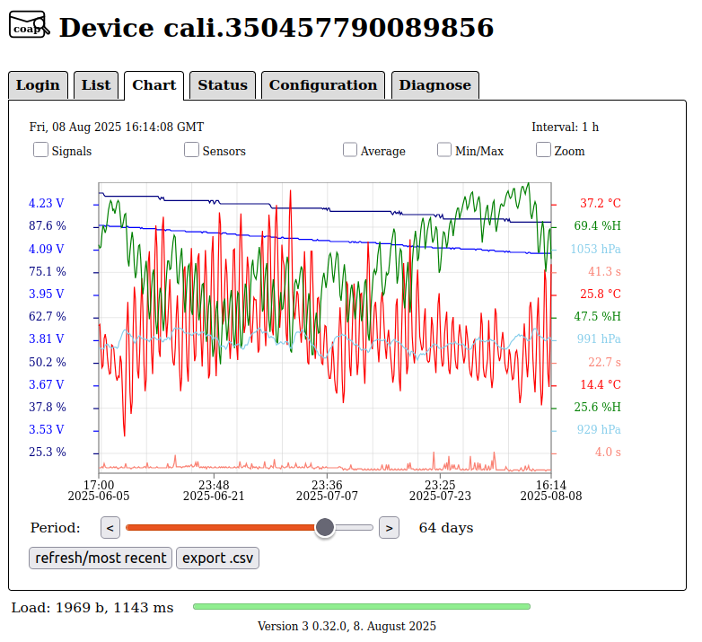

# Californium (Cf) - Cloud CoAP-S3-Proxy Server

## Web UI

The web UI is implemented as `Single Page Application` in plain [javascript](../src/main/resources/app.js). That allows to use it with a lot of devices, which just needs to come with an modern web-browser.

On start, the login page asks for your web-login and internally returns the signing credentials to access the device data on S3. The protection mechanisms on S3 depends on the provider and not all have a fine-grained permission model. Therefore just a basic permission model with read rights based on S3 buckets is used. Writes are supported via the HTTP login host and a user must have the device to write in one of the groups associated to the user.

With the introduction of the archive files, there is also a new javascript version supporting these files. Append "/v2" to your hostname and that will be loaded. This will change in the future and will become the default and the old, series-file based web UI will then be available with "/v1".

To open the web application enter 

`https://<your-hostname>` in the browser or `https://<your-hostname>/v2` for the version with archive file support.

### Web-Browser Application Login View

To get access to the device data, enter the name and password and press "Login". When you're done with the device data, press "Logout" to ensure, the credentials are destroyed and order to protect them from being misused. If you close the browser or the page without logout, you will be warned about that with "leaving the page" and you need to select "leave page".

Sometimes new javascript are published, but the web-browser doesn't always refresh it. Therefore the web applications checks for updates on login an indicates a new version with "(Please refresh, update available!)" appended to the shown version.

### Web-Browser Application Device List View

After login the view is switching to the device list.

The list contains an overview of selected device data. The list of columns is configurable and may be different for your user. Using `<<` or `>>` switches the list to the begin or end. With `<` and `>` you move the list one page to the begin or end.

When the list is shown at the begin, clicking on the column titles, `Device`, `Last Update`, `Provider`, `Operator`, `Bd` (Band), `Uptime`, or `Bat.`, will sort the list according the values of that column. If you click again, the order is reverted.

If you `refresh` the list, updated entries will be shown with a light yellow background and marked with an `*`. New entries will be shown with `+` and a yellow background.

**Web UI V2 only:** If devices are using the **CUSTOM_OPTION_INTERVAL** to send the expected time until the next regular message, a `!` and light red background signals, that the next regular message of that device is missing. If the second regular message is missing, `!!` are shown on a red background. With 10 missing regular messages, the view switches to `-` without a colored background. It is also possible to sort the devices according their state, pressing the empty button in the title line. The precedence is `!!`, `!`, `+`, `*`, `<space>` and `-`.

### Web-Browser Application Chart View

The chart view shows some selected values as chart. The unit and scale of that unit is on the y-axis of both sides in the same color as the line in the chart.

With the slidebar the displayed period is selected. Short periods up to 10 days may be selected by steps in single days, larger periods are selected in steps of multiple days.

At the top of the chart several checkboxes are available. With `Signals` you select the technical values, battery voltage, battery level, signal level, signal quality, number of retransmissions, and RTT. With `Sensors` you get for a `Thingy:91` the temperature, air pressure and humidity. For other devices you may get other values. With `Average` and `Min/Max` you select, how multiple values are mapped into a single point. `Zoom` extends the value range to the mostly full y-axis.

)

Using the cursor is slightly different when using an smartphone or an PC. With the PC move the cursor over the chart and the timepoint and a set of values at that time is shown (see lower right in the above chart). If you click on that position, this position will be the new center of the chart and the `Status` view will show the data at that timepoint. If there is not enough data for that timepoint and period, then the chart is moved to the end and the clicked position will be out of the center. For smartphones it's only possible to click and select the center and the timepoint of the `Status` view.

### Web-Browser Application Device Status View

The status view shows the data received from the device. If no other timepoint is selected in the `Chart` view, the last received data is shown. Otherwise the data from the timepoint selected in the `Chart` view.

At the top, the timepoint of the receiving the shown data is displayed. If available, the network status is extracted and displayed at the head below the timepoint. The payload of the the device data follows.

Below the payload field you may use the `<1000`, `<100`, `<20`, `<10` or `<` to show earlier requests. Or `>`, `10>`, `20>`, `100>` and `1000>` to show later ones. `refresh/most recent` shows then the latest received data. If you navigate to the received data, the center of the  `Chart` view will follow that.

## Web-Browser Application Device Configuration View

The configuration view shows the data send to the device on response. Above the data field the timepoint of writing that data to the server is displayed. If that timepoint is newer than the timepoint of the last received data, then the timepoint shows a yellow background indicating, that the data wasn't received by the device yet.

If your user has `write` rights, then you may edit that data and use the `write` button to transfer that edited data to the server. The `refresh/most recent` is used to check, if the device has send new data and so received the configuration back as response.

**Note:** if two users are logged in at the same time and write the configuration data to the server at the same time, the outcome is undefined.

## Web-Browser Application Server Diagnose View

The diagnose view shows the list of network interfaces at the head. If you select one, you get the traffic statistic of that and this interface is displayed with an yellow background.

This information in the statistic field starts with the last system start time and the maximum number of supported connections. The `since:` line shows, how many seconds the current period lasts. That is followed by sections, which contains lines. Each of these lines starts with the topic followed by the number for the current period and the overall number. When switching to the next period, that values are transferred to the overall number and the current number is reseted.

`S3-Proxy` section shows a statistic about observe notifies and S3 processing. Though observes are not intended to be used with the S3-Proxy, that section is left out, if no observes are used. The `S3 processing` usually accumulates the received device data into an archive file once a day. The shown numbers are covering the processing in the S3 domain of the web-user.

`dtls` section shows a statistic about the DTLS 1.2 CID layer. "handshakes failed" should usually show pretty small numbers, "dropped received records" and "dropped received mac-errors" should as well usually show such small numbers. If you detect higher numbers, you system may be under attack and you may need other tools to identify and mitigate an attack. The server itself uses `fail2ban` to block such traffic temporary at the cloud-VM firewall.

`coaps` section shows a statistic about the CoAP layer. Large numbers in "recv-duplicate requests" may indicate, that the device clients are using too short transmission timeouts.

